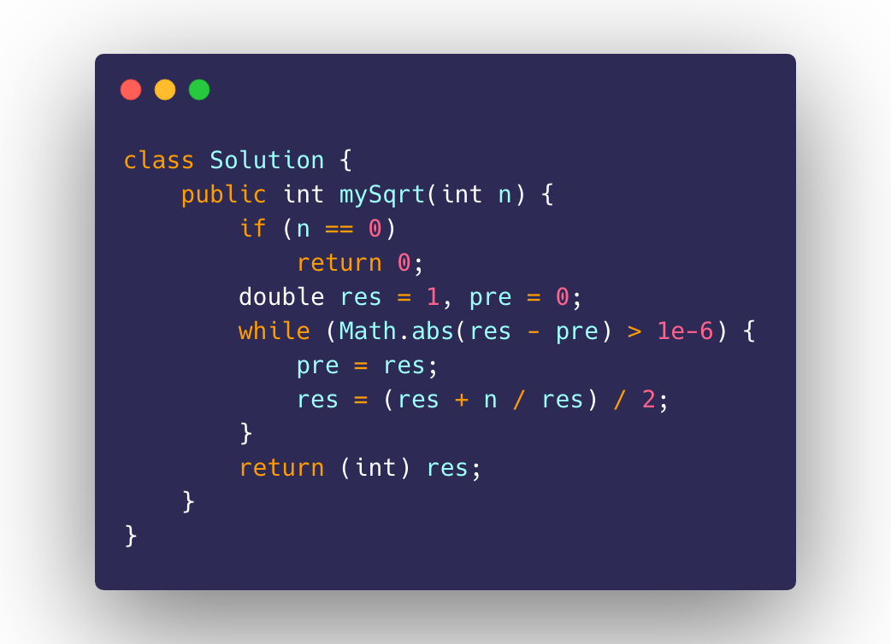

[中文](README_CN.md) | [English](README_EN.md)

  
  <h1 align="center">
    LeetCode
  </h1>
  <h3 align="center">
    A collection of LeetCode Q&A
  </h3>

 

  

### Intro.

- Start Time: June 22, 2019
- Language: Java

---

### How to contribute?

- :star: Star and Fork to motivate author to keep update
- :hammer: Feel free to attach your solutions with detailed explanation or comments besides confused lines of code
- :tada: Share it to your friend circle and community
- :bulb: Pull request and throw Issues for better performance of code

---

### How to share code?

- Under `Code` section of each file
- specify the language you use
- attach your solutions with detailed explanation
- pull request to merge to `master`

---

### Acknowledgment.

 
